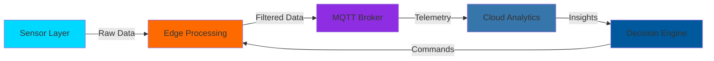

<div align="center">

# MOUNA


</div>

---

## 🎯 Mission Statement

> *"Bridging the physical and digital worlds through intelligent embedded systems that don't just collect data—they make decisions."*

I architect **production-grade IoT ecosystems** where hardware efficiency meets software intelligence. From bare-metal firmware to cloud-connected AI systems, I build solutions that scale.

---

## 💼 Technical Identity

```python
class EmbeddedSystemsEngineer:
    def __init__(self):
        self.role = "Embedded Systems & Digital Services Engineering Student"
        self.focus = ["Real-Time Architectures", "Intelligent IoT", "Edge AI"]
        self.philosophy = "Performance by design, not by accident"
    
    def current_stack(self):
        return {
            "hardware": ["STM32", "ESP32", "nRF52", "Raspberry Pi"],
            "rtos": ["FreeRTOS", "Zephyr", "Bare Metal"],
            "languages": ["C/C++", "Python", "Rust (learning)"],
            "ai_ml": ["TensorFlow Lite", "YOLO", "OpenCV"],
            "protocols": ["MQTT", "CoAP", "LoRaWAN", "BLE", "Modbus"],
            "tools": ["STM32CubeIDE", "PlatformIO", "Docker", "Git"]
        }
    
    def design_principles(self):
        return [
            "⚡ Real-time constraints are non-negotiable",
            "🔒 Security from silicon to cloud",
            "📊 Data-driven optimization",
            "🔄 Modular, testable architectures"
        ]
```

---

## 🏗️ System Architecture Expertise

<table>
<tr>
<td width="50%">

### 🔌 Hardware Layer
- **Microcontrollers**: STM32 (F4/H7), ESP32-S3, Nordic nRF52
- **Sensors**: I²C/SPI interfacing, ADC optimization
- **Power**: Low-power design, battery management
- **PCB**: Schematic design, signal integrity

</td>
<td width="50%">

### 💻 Software Layer
- **Firmware**: HAL, LL drivers, DMA, interrupts
- **RTOS**: Task scheduling, semaphores, queues
- **Networking**: TCP/IP stack, wireless protocols
- **AI**: Edge inference, model quantization

</td>
</tr>
</table>

---

## 🎯 Featured Engineering Projects

<details open>
<summary><b>🧊 EcoCold – Industrial Cold Chain Intelligence</b></summary>

**Challenge**: Monitor temperature-sensitive cargo across distributed facilities  
**Solution**: Multi-node IoT system with predictive anomaly detection

- 📡 ESP32-based sensor nodes with LoRaWAN long-range communication
- 🌡️ DHT22 + DS18B20 redundant temperature sensing (±0.5°C accuracy)
- ⚡ Ultra-low power: 6 months on single 18650 battery
- 📊 Real-time dashboards with threshold alerts via MQTT → Node-RED → InfluxDB
- 🧠 ML-based temperature trend analysis for predictive maintenance

**Tech Stack**: `ESP32` `LoRa` `FreeRTOS` `MQTT` `Python` `InfluxDB`

[🔗 View Project](#) | [📄 Technical Docs](#)

</details>

<details>
<summary><b>🔐 SecureEntry – RFID Access Control Ecosystem</b></summary>

**Challenge**: Design scalable, secure access management for multi-building campus  
**Solution**: Distributed RFID system with centralized authentication

- 🔑 RC522 RFID reader + ESP8266 WiFi controller
- 🗄️ MySQL backend with encrypted credential storage
- 🔔 Real-time access logs with webhook notifications
- 🌐 RESTful API for mobile app integration
- 🔒 AES-encrypted card-to-server communication

**Tech Stack**: `ESP8266` `RFID (MFRC522)` `MySQL` `Flask API` `AES Encryption`

[🔗 View Project](#) | [📊 System Diagram](#)

</details>

<details>
<summary><b>👁️ VisionGuard – AI-Powered Edge Surveillance</b></summary>

**Challenge**: Real-time object detection with privacy-first design  
**Solution**: On-device AI inference without cloud dependency

- 🎥 Raspberry Pi 4 + Coral TPU accelerator
- 🧠 YOLOv8 nano model (85 FPS, 15ms latency)
- 🚨 Automated alert system for anomaly events
- 📹 H.264 video encoding with motion-triggered recording
- 🔒 Local processing—no video data leaves the device

**Tech Stack**: `Raspberry Pi` `TensorFlow Lite` `Coral TPU` `OpenCV` `Python`

[🔗 View Project](#) | [🎬 Demo Video](#)

</details>

---

## 🛠️ Engineering Toolkit

<div align="center">

### Embedded Development


### Programming Languages


### AI & Machine Learning


### IoT Protocols & Communication


### Development Tools


### Databases & Backend


</div>

---

## 📊 GitHub Analytics

<div align="center">
  
  
</div>

<div align="center">
  
</div>

---

## 🌐 System Architecture Philosophy



**Design Principles:**
- 🎯 **Edge-First Computing**: Process data where it's generated
- 🔒 **Defense in Depth**: Security at every layer
- ⚡ **Real-Time Guarantees**: Deterministic response times
- 📈 **Horizontal Scalability**: Add nodes without redesign

---

## 📚 Knowledge Base & Publications

- 📖 **"Optimizing FreeRTOS Task Scheduling for Multi-Sensor IoT Nodes"** — *Personal Blog*
- 🎓 **"Low-Power LoRaWAN Design Patterns"** — *Engineering Thesis (In Progress)*
- 💡 **Contributing to**: `ESP-IDF`, `TensorFlow Lite Micro`, `Zephyr RTOS`

---

## 🤝 Let's Build Something

<div align="center">

[](https://www.linkedin.com/in/mouna-mouhib-a1789b320/)
[](mailto:mouna0mouhib@gmail.com)
[](file:///C:/Users/DELL/Desktop/portfolio.html)
[](https://twitter.com/YOUR_HANDLE)

</div>

---

<div align="center">

### 💡 Open to Collaborate On:
🔹 Industrial IoT Solutions | 🔹 Edge AI Systems | 🔹 Smart City Infrastructure | 🔹 Open Source Hardware

**"Code that matters runs on hardware that lasts."**


</div>
